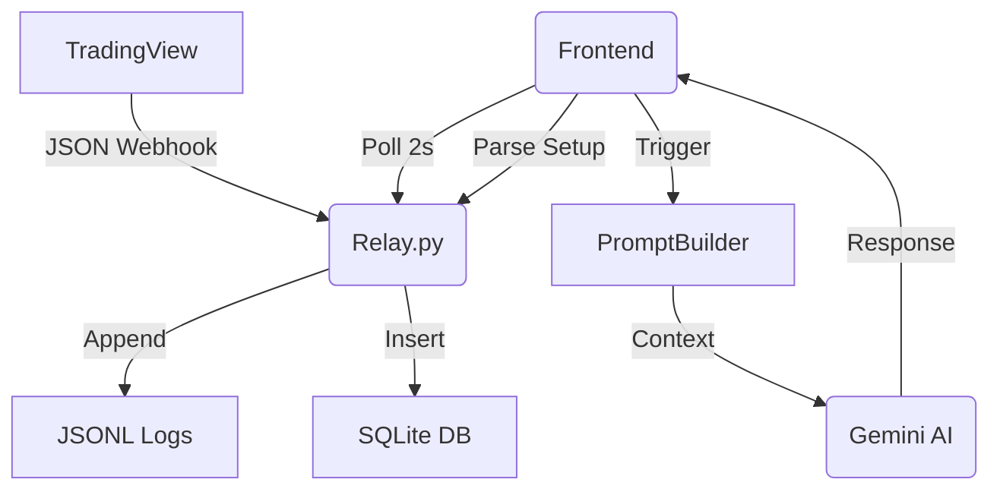

# Architecture & Patterns

## High-Level Pattern: The Agentic Loop
Sieben Capital operates as an **Agentic Loop** driven by incoming market telemetry. It is not a traditional CRUD app; it's a decision-making engine.

1. **Telemetry Ingest**: TradingView alerts (PineScript) -> Flask Relay (Webhook).
2. **Context Persistence**: Relay synthesizes RAW data into JSONL/SQLite logs.
3. **Frontend Polling**: React (`index.tsx`) polls `/api/status` every 2000ms.
4. **Trigger Events**:
   - `Plan de Vuelo` (Manually triggered before session).
   - `Apertura` (Automatic at 08:55 Vector).
   - `Updates` (Cyclical during session).
5. **Agent Deliberation (The Chain)**:
   - Request -> `promptBuilder.ts` (Dynamic instructions) -> Gemini 2.0.
   - Response -> Logic (Parsed by Regex for Setups/Risk) -> DB + UI.

## Component Responsibilities

### [Jim] Context & Regime
- Role: Market structure analysis.
- Input: MGI Data, Macro, VWAP.
- Output: Directional bias, regime classification.

### [Axe] Microstructure & Execution
- Role: Precise entry/exit identification.
- Input: Price Action, Tape (implied), Institutional levels.
- Output: Structured trade setups (JSON-parsable).

### [Taylor] Risk & Sizing
- Role: Capital protection.
- Input: Account balance, SL distance, Risk parameters.
- Output: Position sizing, SL/TP validation.

### [Wendy] Psyche & Mental
- Role: Emotional monitoring.
- Input: Operator mental check, Energy levels.
- Output: Veto or Approval for flight.

### [Wags] CIO & Summary
- Role: Executive summarization.
- Output: Concise recap of committee decisions.

## Data Flow Diagram

